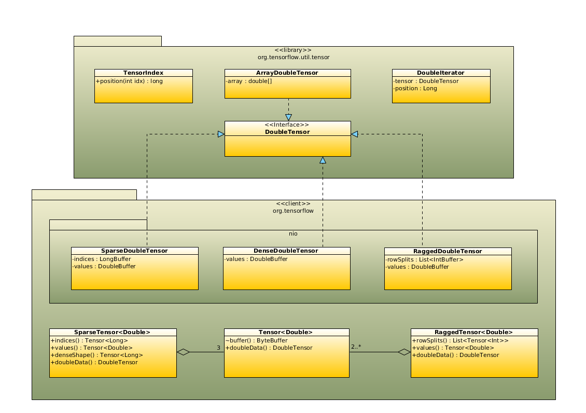

# Java Tensor IO

| Status        | Proposed       |
:-------------- |:---------------------------------------------------- |
| **Author(s)** | Karl Lessard (karl.lessard@gmail.com) |
| **Updated**   | 2019-05-10                                           |

## Objective

Simplify and improve performances of creating and reading tensor data in Java with non-blocking I/O
access to their native buffers.

## Motivation

Currently, the most common way to create tensors in Java is by invoking one of the
factory methods exposed by the [`Tensors`](https://github.com/tensorflow/tensorflow/blob/master/tensorflow/java/src/main/java/org/tensorflow/Tensors.java)
class. While the signature of those methods are pretty elegant, by accepting a simple multidimensional Java array 
as an argument, they make heavy use of reflection techniques to extract the shape and the size of the tensors 
to allocate and result in multiple data copies. This results in poor performances, as discussed in [this issue](https://github.com/tensorflow/tensorflow/issues/8244).

Reading tensor data uses [similar techniques](https://github.com/tensorflow/tensorflow/blob/c23fd17c3781b21bd3309faa13fad58472c78e93/tensorflow/java/src/main/java/org/tensorflow/Tensor.java#L449) and faces the same performance issues. It can also result in multiple data copies, which
is not convenient when dealing with large tensors (e.g. see [`writeTo()`](https://github.com/tensorflow/tensorflow/blob/c23fd17c3781b21bd3309faa13fad58472c78e93/tensorflow/java/src/main/java/org/tensorflow/Tensor.java#L483) methods, for example).

Now that it is possible to run eagerly TensorFlow operations in Java, it is imperative that the 
I/O access to the tensor memory is efficient enough to let the users peek at the data without a significant
performance hit.

By developing a new set of I/O utility classes, we can allow the user to access directly the tensor native
buffers, avoiding data copies, while still preventing mistakes that could break their internal format. Also, 
those utilities can help to improve the manipulation of n-dimension data structures in Java in general.

## User Benefit

Users who are actually using factories and read/write methods from `Tensors/Tensor` classes should notice great 
performance improvements after switching to the new set of I/O utilities.

Users executing their operations in an eager environment will also find it very useful and efficient 
to access directly the tensor data without the need of copying their buffer.

In addition, we will take advantage of those new utilities to help the creation of two other types of tensors in
TensorFlow (sparse and ragged) that is not explicitly supported right now by the Java client.

## Design Proposal

*Note: This design proposal assumes that we run in a Java >= 8 environment, which is not the case with
current client that is configured to compile in Java 7, for supporting older Android devices. We need to confirm
with Android team if it is ok now to switch to Java 8 if the TF Java remains in the main repository.*

### Tensor Utilities

A new utility library (`org.tensorflow:tensorflow-utils`) to be distribute with the TensorFlow Java client
will include a set of interfaces and classes that provide direct I/O access to the data buffer of a tensor in TensorFlow,
normally represented as a multidimensional arrays.

The <code><i>Type</i>Tensor</code> interfaces are the core of new framework and work in pair with the current `Tensor<>`
class, which is just a symbolic handle to a tensor. For each tensor datatype supported in Java, a 
<code><i>Type</i>Tensor</code> interface variant is provided, allowing users to work with Java primitive types which 
tends to be less memory-consuming and provide better performances than their autoboxed equivalent.

For readability, only the `Double` variant of this interface is shown below:
```java
interface DoubleTensor {
  int rank();  // number of dimensions (or rank) of this tensor
  long size(int dimension);  // number of elements in the given dimension
  long totalSize();  // total number of elements in this tensor
  
  DoubleTensor slice(int... indices);  // returns a slice of this tensor
  DoubleTensor slice(TensorIndex... indices);  // returns a slice of this tensor, using various types of indices
  Iterable<DoubleTensor> elements();  // iterates through the elements of the first axis of this tensor
  DoubleIterator scalars();  // iterates through the elements of a rank-1 tensor

  // Read operations
  double get(int... indices);  // get the scalar value of a rank-0 tensor (or a slice of)
  DoubleStream stream(int... indices);  // get values of this tensor (or a slice of) as a stream
  void copyTo(double[] array, int... indices);  // get values of this tensor (or a slice of) into `array`
  void copyTo(DoubleBuffer buffer, int... indices);  // copy values of this tensor (or a slice of) into `buffer`
  void copyTo(DoubleTensor array, int... indices);  // copy values of this tensor (or a slice of) into `tensor`
  void read(OutputStream ostream);  // read elements of this tensor across all dimensions into `ostream` 
  
  // Write operations
  void set(double value, int... indices);  // set the scalar value of this rank-0 tensor (or a slice of)
  void copy(DoubleStream stream, int... indices);  // copy elements of `stream` into this tensor
  void copy(DoubleBuffer buffer, int... indices);  // copy elements of `buffer` into this tensor
  void copy(double[] array, int... indices);  // copy elements of `array` into this tensor
  void copy(DoubleTensor tensor, int... indices);  // copy elements of `tensor` into this tensor
  void write(InputStream istream);  // write elements of this tensor across all dimensions from `istream`
}

class DoubleIterator {
  boolean hasMoreElements();  // true if there is more elements
  double get();  // returns the current element and increment position
  DoubleIterator put(double value);  // sets the current element and increment position, returns this
  void forEach(DoubleConsumer func);  // consume all remaining elements
  void onEach(DoubleSupplier func);  // supply all remaining elements
}
```
The allocation of <code><i>Type</i>Tensor</code> instances is done through a new set of factory methods
added to `org.tensorflow.Tensors`, described in the following sections of this document.

The <code><i>Type</i>Tensor</code> interfaces support normal integer indexation, similar to Java arrays. 

Ex: let `tensor` be a matrix on `(x, y)`
```java
tensor.get(0, 0);  // returns scalar at x=0, y=0 (similar to array[0][0])
tensor.set(10.0, 0, 0);  // sets scalar at x=0, y=0 (similar to array[0][0] = 10.0)
tensor.stream(0);  // returns vector at x=0 as a stream
```
It is also possible to create slices of a tensor, to work with a reduced view of its elements. The first variant 
of `slice()` accept usual integer indices, to slice at a specific element in the tensor. The second variant 
accepts special indices, which offer more flexibility like iterating through the elements of a tensor on any 
of its axis or use values of another tensor as indices.

Here is a non-exhaustive list of special indices that could be possibly created. Each of them are exposed as static
methods in `TensorIndex`, which return an instance of the same class:
* `at(int i)`: match element at index `i`
* `all()`: matches all elements in the given dimension
* `incl(int i...)`: matches only elements at the given indices
* `excl(int i...)`: matches all elements but those at the given indices
* `range(int start, int end)`: matches all elements whose indices is between `start` and `end`
* `even()`, `odd()`: matches only elements at even/odd indices
* `mod(int m)`: matches only elements whose indices is a multiple of `m`
* `IntTensor` and `LongTensor` will also implement the `TensorIndex` interface, to allow indexation
using rank-0 or rank-1 tensors.

Ex: let `tensor` be a 3D matrix on `(x, y, z)`
```java
tensor.slice(0);  // returns matrix at x=0
tensor.slice(0, 0);  // returns vector at x=0, y=0 (on z axis)
tensor.slice(all(), at(0), at(0));  // returns vector at y=0, z=0 (on x axis)
tensor.slice(at(0), all(), at(0));  // returns vector at x=0, z=0 (on y axis)
tensor.slice(even());  // returns all (y,z) matrices for all even values of x
tensor.slice(scalar);  // return slice at x=scalar.get()
tensor.slice(vector);  // return slice at x=vector.get(0), y=vector.get(1)
tensor.slice(at(0), vector);  // return slice at x=0, y=vector.get(0), z=vector.get(1)
```
Finally, the `elements()` and `scalars()` methods simplifies sequential operation over the elements of a tensor,
avoiding the user to increment manually an iterator.

Ex: let `vector` be a vector or 3 elements
```java
double d = 0.0;
vector.scalars().onEach(() -> d++);  // vector is [0.0, 1.0, 2.0]
vector.scalars().forEach(System.out::println);  // prints "0.0", "1.0", "2.0"
vector.scalars().put(10.0f).put(20.0f).put(30.0f);  vector is [10.0, 20.0, 30.0]
for (DoubleTensor scalar : vector.elements()) {
  System.out::println(scalar.get());  // prints "10.0", "20.0", "30.0"
}
```
More usage examples are provided at the end of this document.

### Creating Dense Tensors

Dense tensors are represented in TensorFlow as a multidimensional array serialized in a contiguous memory buffer.

Currently, when creating dense tensors, temporary buffers that contains the initial data are allocated by the user 
and copied to the tensor memory (see [this link](https://github.com/tensorflow/tensorflow/blob/a6003151399ba48d855681ec8e736387960ef06e/tensorflow/java/src/main/java/org/tensorflow/Tensor.java#L187) for example). 

Assuming that the shape of the tensor is predetermined, this data copy and additional memory allocation can be avoided by 
writing the data to the tensor memory directly. This only also only possible for datatypes whose length is fixed.
To create a densor tensor, new methods called <code>tensorOf<i>Type</i></code> will be added a new 
`Tensors` factory class, as follow:
```java
public static DenseFloatTensor ofFloat(long[] shape);
public static DenseDoubleTensor ofDouble(long[] shape);
public static DenseIntTensor ofInt(long[] shape);
public static DenseLongTensor ofLong(long[] shape);
public static DenseBooleanTensor ofBoolean(long[] shape);
public static DenseByteTensor ofUInt8(long[] shape);
public static DenseStringTensor ofString(long[] shape, int elementLength, byte paddingValue);
public static DenseArrayStringTensor ofString(long[] shape);
```
Each of these factories instantiate an instance of <code>Dense<i>Type</i>Tensor</code> as a implementation
for a <code><i>Type</i>Tensor</code>. Here is what the `Double` variant may look like this:
```java
final class DenseDoubleTensor implements DoubleTensor, Operable<Double>, AutoCloseable {
  DenseDoubleTensor(long[] shape) {
    values = Tensor.create(Double.class, shape);  // creates an empty tensor in TensorFlow
    buffer = tensor.buffer().asDoubleBuffer();
  }  
  @Override public Tensor<Double> toTensor() {  // tensor to be passed in TensorFlow operations
    return values;
  }
  @Override public void close() {
    tensor.close();
  }
  // implement DoubleTensor interface writing from and reading to `buffer`...

  private final Tensor<Double> values;
  private final DoubleBuffer buffer;
}
```
<i>Note: more details on the `Operable` interface are coming in the next sections.</i>

It is important to note that for the `String` datatype, the shape is not enough to compute the size in bytes of the tensor
to allocate. If each scalar element is of a variable-length, data must be first collected before allocating the tensor.
In this case, we will use a different type of implementation that stores elements in a flat array before being copied to a real
tensor buffer. Such implementation may look like this:
```java
final class DenseArrayStringTensor implements StringTensor, Operable<String> {
  DenseArrayStringTensor(long shape[]) {
    values = new String[numElements(shape)];
  }
  @Override public Tensor<String> toTensor() {  // tensor to be passed in TensorFlow operations
    Tensor<String> tensor = Tensor.create(String.class, shape, computeSizeInBytes());  // create empty tensor in TensorFlow
    // fill tensor with strings offsets
    for (String element : elements) {
      // fill tensor with strings vararg size and value
    }
    return tensor;
  }
  // implement StringTensor interface writing from and reading to `elements`...

  private final String[] values;
}
```

### Creating Sparse Tensors

A sparse tensor is a collection of 3 dense tensors (indices, values and dense shape). Actually there is no
other way in TF Java to allocate such tensor than allocating and manipulating individually the 3 tensors.

We can simplify this process by following the same approach as dense tensors and use the same 
<code><i>Type</i>Tensor</code> interfaces. Following methods will be added to the `Tensors` class
to allocate sparse tensors.
```java
public static SparseFloatTensor ofSparseFloat(long[] shape, int numValues);
public static SparseDoubleTensor ofSparseDouble(long[] shape, int numValues);
public static SparseIntTensor ofSparseInt(long[] shape, int numValues);
public static SparseLongTensor ofSparseLong(long[] shape, int numValues);
public static SparseBooleanTensor ofSparseBoolean(long[] shape, int numValues);
public static SparseByteTensor ofSparseUInt8(long[] shape, int numValues);
public static SparseStringTensor ofSparseString(long[] shape, int numValues, int elementLength, byte paddingValue);
public static SparseArrayStringTensor ofSparseString(long[] shape, int numValues);
```
This time, not only the shape is known in advance but also the number of values that will actually be set in the
sparse tensor. The <code>Sparse<i>Type</i>Tensor</code> classes allocate 3 dense tensors to hold different data of a sparse
tensor: its <i>indices</i>, its <i>values</i> and its <i>dense shape</i>. Again, let's use the `Double` variant as an example:
```java
final class SparseDoubleTensor implements DoubleTensor, AutoCloseable {
  SparseDoubleTensor(long[] shape, long numValues) {
    indices = Tensors.ofLong(new long[]{shape.length, numValues});
    values = Tensors.ofDouble(new long[]{numValues});
    denseShape = Tensors.ofLong(new long[]{shape.length});    
    denseShape.copy(shape);    
    
    indicesBuffer = indices.buffer().asLongBuffer();
    valuesBuffer = values.buffer().asDoubleBuffer();
  }  
  public Operable<Long> indices() {
    return indices;
  }
  public Operable<Double> values() {
    return values;
  }
  public Operable<Long> denseShape() {
    return denseShape;
  }
  @Override public void close() {
    indices.close();
    values.close();
    denseShape.close();
  }
  // implement DoubleTensor interface writing from and reading to `indicesBuffer` and `valuesBuffer`...

  private final DenseLongTensor indices;
  private final DenseDoubleTensor values;
  private final DenseLongTensor denseShape;
  
  private final LongBuffer indicesBuffer;
  private final DoubleBuffer valuesBuffer;  
}
```
Once again, it is important to note the exception with a tensor of strings with variable-length. As with dense tensors,
the data will be collected in an array first before being copied to a real tensor buffer.

### Creating Ragged Tensors

A ragged tensor is a tensor that is composed of one or more ragged or dense tensors. Ragged tensors allow
users to work with variable-length elements in any dimension (except of the first). 

We can simplify this process by following the same approach as with other types of tensors and use the same 
<code><i>Type</i>Tensor</code> interfaces. Following methods will be added to the `Tensors` class
to allocate sparse tensors.
```java
public static RaggedFloatTensor ofRaggedFloat(long[] shape);
public static RaggedDoubleTensor ofRaggedDouble(long[] shape);
public static RaggedIntTensor ofRaggedInt(long[] shape);
public static RaggedLongTensor ofRaggedLong(long[] shape);
public static RaggedBooleanTensor ofRaggedfBoolean(long[] shape);
public static RaggedByteTensor ofRaggedUInt8(long[] shape);
public static RaggedStringTensor ofRaggedString(long[] shape);
```
All ragged dimensions in the tensor have a value of `-1` in the `shape` attribute. Since ragged tensors always 
work with variable-length values, data must be first collected before the tensor buffer is allocated 
and initialized. 

It is also important to note that as opposed to the other type of tensors, which forbid to access an element outside the
boundaries of the current shape, ragged dimensions will automatically grow as elements are inserted to the tensor. Let's
take again the `Double` variant in our implementation example <span style="color:red">TODO</span>

### Reading Tensor Data

In the current TF Java language bindings, to read data from a tensor, the user needs to create a temporary buffer into which 
its data is copied. Again, this data copy and additional memory allocation can be avoided by accessing the tensor buffer 
directly when reading its data.

Tensors are returned by TensorFlow operations in their symbolic format `Tensor<>`. To convert it to a 
<code><i>Type</i>Tensor</code> and access directly its data, following methods will be added to the `Tensors` (for
simplicity, only the `Double` variants are listed below):
class:
```java
public static DenseDoubleTensor ofDouble(Tensor<Double> t);
public static DenseDoubleTensor ofDouble(Operand<Double> op);  // shortcut for ofDouble(op.asOutput().tensor());
public static SparseDoubleTensor ofSparseDouble(Tensor<Long> indices, Tensor<Double> values, Tensor<Long> denseShape);
```

### TensorFlow Operations

Right now, the creation of [constant operands](https://github.com/tensorflow/tensorflow/blob/master/tensorflow/java/src/main/java/org/tensorflow/op/core/Constant.java) 
in Java uses the same reflection techniques as with tensors. A simple fix is to add a new factory that takes a `Operable<T>`
in input, from which we retrieve the tensor using `toTensor()`:
```java
Constant<T> create(Operable<T> operable);
```
This factory will be mapped to the `Ops` class as any other factory, so it could be invoked like this:
```java
Ops tf = Ops.create();

DenseDoubleTensor t = Tensors.ofDouble(new long[]{2, 2});
t.copy(new double[]{0.0, 1.0, 2.0, 3.0});
Constant<Double> c = tf.constant(t);  // takes a snapshot of this tensor as a constant operand
```
Note that in this case, there is no need to close explicitly the `Tensor<>` (or with a `try-with-resource` block), 
because eager execution environments already take care of closing discardable resources automatically.

Unlike NumPy in Python, the <code><i>Type</i>Tensor</code> interface do not expose per design linear algebra operations 
(e.g. matrix addition, substraction, etc.). Since eager execution in Java is supported, users who wants to execute
such operation can simply use TensorFlow directly. e.g.
```java
Ops tf = Ops.create();

DenseFloatTensor v1 = Tensors.ofFloat(new long[]{2});
v1.scalars().put(0.0f).put(1.0f);
Constant<Float> c1 = tf.constant(v1);

DenseFloatTensor v2 = Tensors.ofFloat(new long[]{2});
v2.scalars().put(2.0f).put(3.0f);
Constant<Float> c2 = tf.constant(v2);

Add<Float> sum = tf.math.add(c1, c2);
Pow<Float> pow = tf.math.pow(sum, c2);
FloatVector result = Tensors.ofFloat(pow);  // [4.0f, 64.0f]
```
Some other JVM languages offer more tools to create a rich API for calling those operations on top of the interfaces
proposed in this document and their implementation is postponed as a future development (e.g. Scala and Kotlin
custom operators or Kotlin infix methods).

## Detailed Design

### Suggested class diagram (overview, double only)



### Example of usage

```java

// Creating boolean scalar
BooleanTensor scalar = Tensors.ofBoolean(Shape.scalar());

scalar.rank();  // 0
scalar.size(0);  // error
scalar.totalSize();  // 1

// Setting scalar value
scalar.set(true);

// Creating integer vector
IntTensor vector = Tensors.ofInt(new long[]{4});

vector.rank();  // 1
vector.size(0);  // 4
vector.totalSize();  // 4

// Setting first elements from array and add last element directly
vector.copy(new int[]{1, 2, 3}, 0);
vector.set(4, 3); 

// Creating float matrix
FloatTensor matrix = Tensors.ofFloat(new long[]{2, 3});

matrix.rank();  // 2
matrix.size(0);  // 2
matrix.totalSize();  // 6

// Initializing data using iterators
Iterator<FloatTensor> rows = data.elements();
rows.copy(new float[]{0.0f, 5.0f, 10.0f});  // inits data at the current row (0)
FloatIterator secondRow = rows.scalars();  // returns a new cursor at the current row (1)
secondRow.put(15.0f);  // inits each scalar of the second row individually...
secondRow.put(20.0f);
secondRow.put(25.0f);

// Create float 3d matrix
FloatTensor matrix3d = Tensors.ofFloat(new long[]{2, 2, 3});

matrix3d.rank();  // 3
matrix3d.size(0);  // 2
matrix3d.totalSize();  // 12

// Initialize all data from a flat 3d matrix: 
// {{{10.0, 10.1, 10.2}, {11.0, 11.1, 11.2}}, {{20.0, 20.1, 20.1}, {21.0, 21.1, 21.2}}}
matrix3d.copy(DoubleStream.of(10.0, 10.1, 10.2, 11.0, 11.1, 11.2, 20.0, 20.1, 20.2, 21.0, 21.1, 21.2)); 

StringTensor<String> text = Tensors.ofString(new long[]{3});

text.rank();  // 1
text.size(0);  // 3
text.totalSize();  // 3

// Initializing data from input stream, where `values.txt` contains following modified UTF-8 strings:
// "in the town", "where I was", "born"
text.write(new FileInputStream("values.txt"));

// Reading data

scalar.get();  // true
vector.get(0);  // 1
matrix.get(0, 1);  // 5.0f
matrix3d.get(1, 1, 1);  // 21.1
text.get(2);  // "born"

IntBuffer buffer = IntBuffer.allocate(vector.numElements());
vector.copyTo(buffer);  // 1, 2, 3, 4
matrix.stream();  // 0.0f, 5.0f, 10.0f, 15.0f, 20.0f, 25.0f

matrix3d.elements().forEach(c -> c.stream());  // [10.0, 10.1, 10.2, 11.0, 11.1, 11.2], 
                                               // [20.0, 20.1, 20.2, 21.0, 21.1, 21.2] 
text.scalars().forEach(System.out::println);  // "in the town", "where I was", "born"

// Working with slices

scalar.slice(0);  // error
vector.slice(0);  // {1} (rank-0)
matrix.slice(1, 1);  // {20.0f} (rank-0)

matrix3d.slice(0, 0);  // {10.0, 10.1} (rank-1)
matrix3d.slice(all(), at(0));  // {{10.0, 10.1, 10.2}, {20.0, 20.1, 20.2}} (rank-2)
matrix3d.slice(all(), at(0), at(0));  // {10.0, 20.0} (rank-1)
matrix3d.slice(all(), at(0), incl(0, 2));  // {{10.0, 10.2}, {20.0, 20.2}} (rank-2)
matrix3d.slice(all(), all(), excl(1));  // {{{10.0, 10.2}, {11.0, 11.2}}, {{20.0, 20.2}, {21.0, 21.2}}} (rank-3)

text.slice(tf.constant(1));  // {"where I was"} (rank-0 slice)

// Sparse tensors

FloatTensor sparseTensor = Tensors.ofSparseFloat(new long[]{2, 4}, 3);

sparseTensor.set(10.0f, 0, 0);
sparseTensor.set(20.0f, 0, 3);
sparseTensor.set(30.0f, 1, 1);
sparseTensor.set(40.0f, 2, 1);  // fails, index oob

sparseTensor.get(0, 0);  // 10.0f
sparseTensor.get(0, 1);  // 0.0f
sparseTensor.stream();  // [10.0f, 0.0f, 0.0f, 20.0f, 0.0f, 30.0f, 0.0f, 0.0f]

// Ragged tensors

RaggedTensor<Float> raggedTensor = Tensors.ofRaggedFloat(new long[]{3, -1});

raggedTensor.set(10.0f, 0, 0);    
raggedTensor.set(20.0f, 0, 1);
raggedTensor.set(30.0f, 0, 2); 
raggedTensor.set(40.0f, 1, 0);
raggedTensor.set(50.0f, 2, 0);
raggedTensor.set(60.0f, 2, 1);

raggedTensor.get(0, 1);  // 20.0f
raggedTensor.get(1, 0);  // 40.0f
raggedTensor.get(1, 1);  // fails, index oob
raggedTensor.elements().forEach(e -> e.stream());  // [10.0f, 20.0f, 30.0f], [40.0f], [50.0f, 60.0f]
```

## Questions and Discussion Topics

