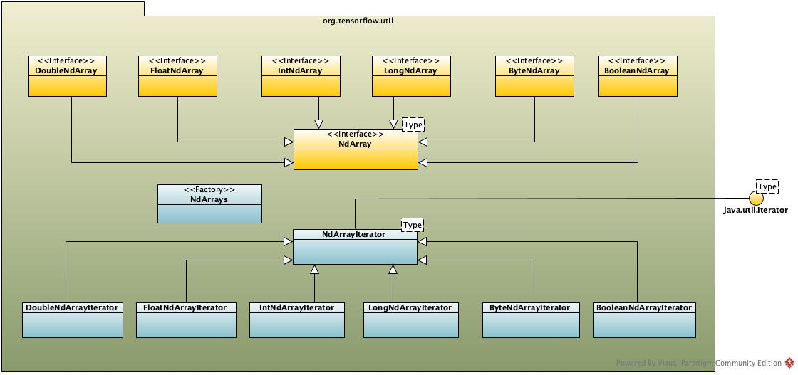

# Java Tensor I/O
| Status        | Proposed       |
:-------------- |:---------------------------------------------------- |
| **Author(s)** | Karl Lessard (karl.lessard@gmail.com) |
| **Updated**   | 2019-06-06                                           |

## Objective

Simplify and improve performances of creating tensors and writing/reading their data in Java by accessing 
directly the native buffers.

## Motivation

Currently, the most common way to create tensors in Java is by invoking one of the
factory methods exposed by the [`Tensors`](https://github.com/tensorflow/tensorflow/blob/master/tensorflow/java/src/main/java/org/tensorflow/Tensors.java)
class. While the signature of those methods are pretty elegant, by accepting a simple multidimensional Java array 
as an argument, they make heavy use of reflection techniques to extract the shape and the size of the tensors 
to allocate and result in multiple data copies. This results in poor performances, as discussed in [this issue](https://github.com/tensorflow/tensorflow/issues/8244).

Reading tensor data uses [similar techniques](https://github.com/tensorflow/tensorflow/blob/c23fd17c3781b21bd3309faa13fad58472c78e93/tensorflow/java/src/main/java/org/tensorflow/Tensor.java#L449) and faces the same performance issues. It can also result in multiple data copies, which
is not convenient when dealing with large tensors (e.g. see [`writeTo()`](https://github.com/tensorflow/tensorflow/blob/c23fd17c3781b21bd3309faa13fad58472c78e93/tensorflow/java/src/main/java/org/tensorflow/Tensor.java#L483) methods, for example).

Now that it is possible to run eagerly TensorFlow operations in Java, it is imperative that the 
I/O access to the tensor memory is efficient enough to let the users peek at the data without a significant
performance hit.

By developing a new set of utility classes, we can allow the user to access directly the tensor native
buffers, avoiding data copies, while still preventing mistakes that could break their internal format. Also, 
those utilities can help to improve the manipulation of n-dimension data structures in Java in general.

## User Benefit

Users who are actually using factories and read/write methods from `Tensors/Tensor` classes should notice great 
performance improvements after switching to the new set of I/O utilities.

Users executing their operations in an eager environment will also find it very useful and efficient 
to access directly the tensor data without the need of copying their buffer.

In addition, we will take advantage of those new utilities to help the creation of two other types of tensors in
TensorFlow (sparse and ragged) that is not explicitly supported right now by the Java client.

## Design Proposal

*Note: This design proposal assumes that we run in a Java >= 8 environment, which is not the case with
current client that is configured to compile in Java 7, for supporting older Android devices. We need to confirm
with Android team if it is ok now to switch to Java 8 if the TF Java remains in the main repository.*

### NdArray API

A new utility library (`org.tensorflow:tensorflow-utils`) will be distribute with the TensorFlow Java client
that includes a set of interfaces and classes to provide direct I/O access to the data buffer of a tensor in TensorFlow,
normally represented as a multidimensional arrays.

The `NdArray` interface is at the core of this new framework. For each TensorFlow datatype supported in 
Java, a variant of <code><i>Type</i>NdArray</code> is also provided, allowing users to work with Java primitive types 
which tends to be less memory-consuming and provide better performances than their autoboxed equivalent.

*Note: as the interfaces are implemented, some of the primitive-based methods might be moved to the
generic NdArray interface using autoboxed types if we discover that the performance hit when using them
is negligible (e.g. if function inlining generally takes place, etc.)*



For readability, only the `Double` variant is detailed below:

```java
interface NdArray<T> extends Iterable<NdArray<T>> {
  long[] shape();  // return the shape of this array
  int numDimensions();  // number of dimensions (or rank) of this array
  long numElements(int dim);  // number of elements in a dimension of this array
  long numElements();  // total number of elements in this array
  boolean isReadOnly();  // returns true if this array is read-only
}

interface DoubleNdArray extends NdArray<Double> {
  DoubleNdArray slice(long... indices);  // returns a slice of this array
  DoubleNdArray slice(NdArrayIndex... indices);  // returns a slice of this array, using various types of indices
  Iterable<DoubleNdArray> typedIterator();  // iterates through the elements of the first axis of this array
  DoubleIterator scalars();  // iterates through the elements of a rank-1 array

  // Read operations
  double get(long... indices);  // get the scalar value of a rank-0 array (or a slice of)
  DoubleStream stream(long... indices);  // get values of this array (or a slice of) as a stream
  void copyTo(double[] array, long... indices);  // get values of this array (or a slice of) into `array`
  void copyTo(DoubleBuffer buffer, long... indices);  // copy values of this array (or a slice of) into `buffer`
  void copyTo(DoubleNdArray array, long... indices);  // copy values of this array (or a slice of) into `array`
  void read(OutputStream ostream);  // read elements of this array across all dimensions into `ostream` 
  
  // Write operations
  void set(double value, long... indices);  // set the scalar value of this rank-0 array (or a slice of)
  void copy(DoubleStream stream, long... indices);  // copy elements of `stream` into this array
  void copy(DoubleBuffer buffer, long... indices);  // copy elements of `buffer` into this array
  void copy(double[] array, long... indices);  // copy elements of `array` into this array
  void copy(DoubleNdArray array, long... indices);  // copy elements of `array` into this array
  void write(InputStream istream);  // write elements of this array across all dimensions from `istream`
}

class DoubleIterator extends ScalarIterator<Double> {
  double get();  // returns the current element and increment position
  DoubleIterator put(double value);  // sets the current element and increment position, returns this
  void forEach(DoubleConsumer func);  // consume all remaining elements
  void onEach(DoubleSupplier func);  // supply all remaining elements
}
```
The `NdArray` interfaces support normal integer indexation, similar to standard Java arrays. 

Ex: let `matrix` be a matrix on `(x, y)`
```java
matrix.get(0L, 0L);  // returns scalar at x=0, y=0 (similar to array[0][0])
matrix.set(10.0, 0L, 0L);  // sets scalar at x=0, y=0 (similar to array[0][0] = 10.0)
matrix.stream(0L);  // returns vector at x=0 as a stream
```
It is also possible to create slices of an array, to work with a reduced view of its elements. The first variant 
of `slice()` accept usual integer indices, to slice at a specific element in the array. The second variant 
accepts special indices, which offer more flexibility like iterating through the elements of an array on any 
of its axis or use values of another array as indices.

Here is a non-exhaustive list of special indices that could be possibly created. Each of them are exposed as static
methods in `NdArrayIndex`, which return an instance of the same class:
* `at(long i)`: match element at index `i`
* `all()`: matches all elements in the given dimension
* `incl(long i...)`: matches only elements at the given indices
* `excl(long i...)`: matches all elements but those at the given indices
* `range(long start, long end)`: matches all elements whose indices is between `start` and `end`
* `even()`, `odd()`: matches only elements at even/odd indices
* `mod(long m)`: matches only elements whose indices is a multiple of `m`
* `IntNdArray` and `LongNdArray` will also implement the `NdArrayIndex` interface, to allow indexation
using rank-0 or rank-1 arrays.

Ex: let `matrix` be a 3D matrix on `(x, y, z)`
```java
matrix.slice(0L);  // returns matrix at x=0
matrix.slice(0L, 0L);  // returns vector at x=0, y=0 (on z axis)
matrix.slice(all(), at(0L), at(0L));  // returns vector at y=0, z=0 (on x axis)
matrix.slice(at(0L), all(), at(0L));  // returns vector at x=0, z=0 (on y axis)
matrix.slice(even());  // returns all (y,z) matrices for all even values of x
matrix.slice(scalar);  // return slice at x=scalar.get()
matrix.slice(vector);  // return slice at x=vector.get(0), y=vector.get(1)
matrix.slice(at(0L), vector);  // return slice at x=0, y=vector.get(0), z=vector.get(1)
```
Finally, the `elements()` and `scalars()` methods simplifies sequential operation over the elements of an array,
avoiding the user to increment manually an iterator.

Ex: let `vector` be a vector or 3 elements

```java
double d = 0.0;
vector.scalars().onEach(() -> d++);  // vector is [0.0, 1.0, 2.0]
vector.scalars().forEach(System.out::println);  // prints "0.0", "1.0", "2.0"
vector.scalars().put(10.0f).put(20.0f).put(30.0f);  vector is [10.0, 20.0, 30.0]
for (DoubleTensor scalar : vector.elements()) {
  System.out::println(scalar.get());  // prints "10.0", "20.0", "30.0"
}
```
Finally, the `NdArray` implementations could be marked as read-only if they should fail on any attempt to update
their data, similar to what we find in Java NIO Buffers. 

More usage examples are provided at the end of this document.

### Additional Notes on NdArray Size

The `NdArray` API supports non-scalar arrays of any rank with up to <code>2<sup>63</sup> - 1</code> elements.
This palliate to the current issue in TF Java where even it is possible to allocate tensors of that size, it is not
possible to read their data since they are mapped to a single `ByteBuffer`, which is limited to
<code>2<sup>31</sup> - 1</code> elements.

Still, some of the read operations listed in the `NdArray` API will fail if the structure acceptings the data 
does not support that number of elements as well. For example, standard Java arrays uses 32-bits indices and therefore
cannot fit the whole data of a `NdArray` with more than `Integer.MAX_VALUE` elements. In this case, 
calling `copyTo(array)` on such array will result in a `BufferUnderflowException`. Calling `stream()` on
the other hand will succeed since Java streams work in 64-bits. 

### Standard NdArray Implementations

The library will also provide a series of basic implementations for an `NdArray` allocated on the heap 
to store dense, sparse and ragged data as a multidimensional array. These implementations, provided inside
the library, are independent from TensorFlow tensors and can be used for other purposes. We will then see 
how those implementations could be useful to instantiate tensors as well.

#### Dense NdArrays

A dense `NdArray`, i.e. an array with a shape of fixed dimensions into which all elements are stored, may be
backed by simple flat array(s) or buffer(s):


#### Sparse NdArrays

A sparse `NdArray` could also be implemented by using 1D flat arrays, but this time only elements explicitly
set are stored.

Every time a value is set in a sparse array, we first check if the element at this index
has already been set. If not, the value is added to `values` and its index in `indices`. Otherwise,
the value is simply updated in `values`.Similarly, when reading a value from the sparse array, 
if the element has been set (i.e. its index is present in `indices`), the value of the element is returned 
or otherwise zero.

This might cause a lot of lookup in the `indices` so some index caching mechanisms should also be added
to this implementation to improve performances.


#### Ragged NdArrays

In a ragged array, one or more dimensions could be of a variable size (i.e. each elements does not contain
the same number of sub-elements).

All ragged dimensions in the tensor have a value of `-1` in the `shape` attribute.  Ragged dimensions will automatically 
grow as elements are inserted to the array. It is also important to note that since
ragged tensors have dimensions of unknown size, it is impossible to write its data without using indices (for example, 
the `copy(...)` methods are supported but `write(...)` is not).


### Tensor NdArray Implementations

While standard `NdArrays` are provided by the new utility library described before, an additional
set of implementations will also be added to the TF Java client to build such arrays on top of tensor 
native memory, in respect with the internal format defined by TensorFlow. 

This way, we can avoid current data copies between the Java heap and the native memory when dealing with tensors
and achieve better performances, while reducing the amount of required memory.

#### Dense Tensors

Dense tensors are represented in TensorFlow as a multidimensional array serialized in a contiguous memory buffer.

Currently, when creating dense tensors, temporary buffers that contains the initial data are allocated by the user 
and copied to the tensor memory (see [this link](https://github.com/tensorflow/tensorflow/blob/a6003151399ba48d855681ec8e736387960ef06e/tensorflow/java/src/main/java/org/tensorflow/Tensor.java#L187) for example). 

To create a densor tensor, the following methods will be added to the `Tensors` factory class:

```java
public static FloatTensor ofFloat(long[] shape);
public static DoubleTensor ofDouble(long[] shape);
public static IntTensor ofInt(long[] shape);
public static LongTensor ofLong(long[] shape);
public static BooleanTensor ofBoolean(long[] shape);
public static UInt8Tensor ofUInt8(long[] shape);
public static StringTensor ofString(long[] shape, int elementLength, byte paddingValue);
```
Each of these factories instantiate an instance of <code><i>Type</i>Tensor</code> as an implementation
for a <code><i>Type</i>NdArray</code>. These implementations are backed by a TensorFlow tensor buffer residing
in native memory and extend from the generic `Tensor` class (which need to be modified as well). They can therefore
be used by TensorFlow for computation. 


The `String` datatype is an exception in TensorFlow, since scalar elements are of variable lengths and 
the shape is not enough to compute the size in bytes of the tensor to allocate. In this case, data must be first collected 
before allocating the tensor. To do this, we can use a `DenseNdArray`, as described before, that will store
elements into a fixed-size array into an array, and create the tensor by copying its data by calling `Tensors.copyOf()`:
```java
public static StringTensor copyOf(NdArray<String> array);
```
Note the implementation class `StringTensor` returned by this method, instead of a simple `Tensor<String>`. The reason is that
string tensors in TensorFlow are formatted in a very specific way and should be handled separately from the generic logic found
in `Tensor`.

#### Sparse Tensors

A sparse tensor is a collection of three dense tensors (indices, values and dense shape). Actually there is no
other way in TF Java to allocate such tensor than allocating and manipulating individually the three tensors.

We can simplify this process by following the same approach as dense tensors, based on the 
`NdArray` interfaces. Following methods will be added to the `Tensors` class to allocate sparse tensors.

```java
public static FloatSparseTensor ofSparseFloat(long[] shape, long numValues);
public static DoubleSparseTensor ofSparseDouble(long[] shape, long numValues);
public static IntSparseTensor ofSparseInt(long[] shape, long numValues);
public static LongSparseTensor ofSparseLong(long[] shape, long numValues);
public static BooleanSparseTensor ofSparseBoolean(long[] shape, long numValues);
public static UInt8SparseTensor ofSparseUInt8(long[] shape, long numValues);
public static StringSparseTensor ofSparseString(long[] shape, long numValues, long elementLength, byte paddingValue);
```
This time, not only the shape is known in advance but also the number of values that will actually be set in the
sparse tensor. The <code><i>Type</i>SparseTensor</code> classes allocate three dense tensors to hold different 
data of a sparse tensor: its <i>indices</i>, its <i>values</i> and its <i>dense shape</i>.


Once again, it is important to note the exception with a tensor of strings with variable lengths. As with dense tensors,
the data will be collected in a multidimensional sparse array first before being copied to a real tensor buffer.
```java
public static StringSparseTensor copyOf(SparseNdArray<String> array);
```

#### Ragged Tensors

Like sparse tensors, there is no other way to allocate a ragged tensors in Java than creating and carrying
distinct tensors to hold, let say, the row splits and the values for all dimensions of that tensor.

We can simplify this process by following the same approach as with other types of tensors, based on the 
`NdArray` interfaces. Since ragged tensors always work with variable-length values, data must be first collected 
before the tensor buffer is allocated and initialized, so a ragged tensor is always a copy of a ragged array.

```java
public static FloatRaggedTensor copyOf(FloatRaggedNdArray array);
public static DoubleRaggedTensor copyOf(DoubleRaggedNdArray array);
public static IntRaggedTensor copyOf(IntRaggedNdArray array);
public static LongRaggedTensor copyOf(LongRaggedNdArray array);
public static BooleanRaggedTensor copyOf(BooleanRaggedNdArray array);
public static UInt8RaggedTensor copyOf(ByteRaggedNdArray array);
public static StringRaggedTensor copyOf(RaggedNdArray<String> array);
```
Once created, ragged tensor cannot expand anymore and are marked as read-only.


### TensorFlow Operations

Unlike NumPy in Python, the proposed classes and interfaces do not expose, per design, linear algebra operations 
(e.g. matrix addition, substraction, etc.). This could be added in a next phase into which we can take advantages of the
nice features offered by other JVM languages, like Kotlin/Scala custom operators or Kotlin infix methods.

So in the scope of this RFC, only the two following points are mandatory: contants and operation outputs.

#### Constants

The current creation of [constant operands](https://github.com/tensorflow/tensorflow/blob/master/tensorflow/java/src/main/java/org/tensorflow/op/core/Constant.java) 
in Java uses the same reflection techniques as with tensors. A simple fix is to add a new factory that takes a `Tensor<T>`
in input:
```java
Constant<T> create(Tensor<T> tensor);
```
For example:
```java
Ops tf = Ops.create(); // creates eager environment for building ops

DoubleTensor t = Tensors.ofDouble(new long[]{2, 2});
t.copy(new double[]{0.0, 1.0, 2.0, 3.0});
Constant<Double> c = tf.constant(t);
```
Note that in this case, there is no need to close explicitly the `Tensor` created because the eager execution 
environment already take care of closing discardable resources automatically.

#### Operation Outputs

Outputs of all operations in TensorFlow can be converted to dense tensors. In eager mode, it is already possible to 
retrieve this tensor by invoking the `Tensor<T> Output<T>.tensor()` method. This returns a tensor in its basic 
`Tensor<>` form.

To convert it back to a `TypeTensor` (and therefore exposing all methods making use of Java primitive types), we could 
add typed conversion methods in the `Tensor` class that convert which will fail if the output is of the wrong datatype. 
This mimics the actual `tensor.*Value()` methods found in the `Tensor` class.

For convenience, those methods could be added to the `Operand` interface as well, which is returned by the operation
wrappers.

Let `c1` and `c2` be scalars of the double type and `tf` an instance of `Ops` running in an eager environment:
```java
Add<Double> sum = tf.math.add(c1, c2);
DoubleTensor result = sum.asOutput().tensor().asDouble();
result = sum.doubleTensor(); // shortcut to the previous line
```

## Detailed Design

### Example of usage

```java

// Creating boolean scalar
BooleanTensor scalar = Tensors.ofBoolean(Shape.scalar());

scalar.numDimensions();  // 0
scalar.numElements(0);  // error
scalar.numElements();  // 1

// Setting scalar value
scalar.set(true);

// Creating integer vector
IntTensor vector = Tensors.ofInt(new long[]{4L});

vector.numDimensions();  // 1
vector.numElements(0);  // 4
vector.numElements();  // 4

// Setting first elements from array and add last element directly
vector.copy(new int[]{1, 2, 3}, 0L);
vector.set(4, 3L); 

// Creating float matrix
FloatTensor matrix = Tensors.ofFloat(new long[]{2L, 3L});

matrix.numDimensions();  // 2
matrix.numElements(0);  // 2
matrix.numElements();  // 6

// Initializing data using iterators
Iterator<FloatTensor> rows = matrix.elements();
rows.next().copy(new float[]{0.0f, 5.0f, 10.0f});  // inits all scalars of the current row (0)
FloatIterator secondRow = rows.next().scalars();  // returns a new cursor to the current row (1)
secondRow.put(15.0f).put(20.0f).put(25.0f);  // inits each scalar of the second row individually...

// Create float 3d matrix
FloatTensor matrix3d = Tensors.ofFloat(new long[]{2L, 2L, 3L});

matrix3d.numDimensions();  // 3
matrix3d.numElements(0);  // 2
matrix3d.numElements();  // 12

// Initialize all data from a flat 3d matrix: 
// {{{10.0, 10.1, 10.2}, {11.0, 11.1, 11.2}}, {{20.0, 20.1, 20.1}, {21.0, 21.1, 21.2}}}
matrix3d.copy(DoubleStream.of(10.0, 10.1, 10.2, 11.0, 11.1, 11.2, 20.0, 20.1, 20.2, 21.0, 21.1, 21.2)); 

// Initializing data from input stream, where `values.txt` contains following modified UTF-8 strings:
// "in the town", "where I was", "born"
NdArray<String> textData = NdArrays.of(String.class, new long[]{3L});
textData.write(new FileInputStream("values.txt"));

StringTensor text = Tensors.copyOf(textData);

text.numDimensions();  // 1
text.numElements(0);  // 3
text.numElements();  // 3

// Reading data

scalar.get();  // true
vector.get(0L);  // 1
matrix.get(0L, 1L);  // 5.0f
matrix3d.get(1L, 1L, 1L);  // 21.1
text.get(2L);  // "born"

IntBuffer buffer = IntBuffer.allocate(vector.numElements());
vector.copyTo(buffer);  // 1, 2, 3, 4
matrix.stream();  // 0.0f, 5.0f, 10.0f, 15.0f, 20.0f, 25.0f

matrix3d.elements().forEach(c -> c.stream());  // [10.0, 10.1, 10.2, 11.0, 11.1, 11.2], [20.0, 20.1, 20.2, 21.0, 21.1, 21.2] 
text.scalars().forEach(System.out::println);  // "in the town", "where I was", "born"

// Working with slices

scalar.slice(0L);  // error
vector.slice(0L);  // {1} (rank-0)
matrix.slice(1L, 1L);  // {20.0f} (rank-0)

matrix3d.slice(0L, 0L);  // {10.0, 10.1} (rank-1)
matrix3d.slice(all(), at(0L));  // {{10.0, 10.1, 10.2}, {20.0, 20.1, 20.2}} (rank-2)
matrix3d.slice(all(), at(0L), at(0L));  // {10.0, 20.0} (rank-1)
matrix3d.slice(all(), at(0L), incl(0L, 2L));  // {{10.0, 10.2}, {20.0, 20.2}} (rank-2)
matrix3d.slice(all(), all(), excl(1L));  // {{{10.0, 10.2}, {11.0, 11.2}}, {{20.0, 20.2}, {21.0, 21.2}}} (rank-3)

text.slice(tf.constant(1));  // {"where I was"} (rank-0 slice)

// Sparse tensors

FloatSparseTensor sparseTensor = Tensors.ofSparseFloat(new long[]{2L, 4L}, 3L);

sparseTensor.set(10.0f, 0L, 0L);
sparseTensor.set(20.0f, 0L, 3L);
sparseTensor.set(30.0f, 1L, 1L);
sparseTensor.set(40.0f, 2L, 1L);  // fails, index oob

sparseTensor.get(0L, 0L);  // 10.0f
sparseTensor.get(0L, 1L);  // 0.0f
sparseTensor.stream();  // [10.0f, 0.0f, 0.0f, 20.0f, 0.0f, 30.0f, 0.0f, 0.0f]

// Ragged tensors

FloatRaggedNdArray raggedData = NdArrays.ofRaggedFloat(new long[]{3L, -1L});

raggedData.set(10.0f, 0L, 0L);    
raggedData.set(20.0f, 0L, 1L);
raggedData.set(30.0f, 0L, 2L); 
raggedData.set(40.0f, 1L, 0L);
raggedData.set(50.0f, 2L, 0L);
raggedData.set(60.0f, 2L, 1L);

FloatRaggedTensor raggedTensor = Tensors.copyOf(raggedData);

raggedTensor.get(0, 1);  // 20.0f
raggedTensor.get(1, 0);  // 40.0f
raggedTensor.get(1, 1);  // fails, index oob
raggedTensor.elements().forEach(e -> e.stream());  // [10.0f, 20.0f, 30.0f], [40.0f], [50.0f, 60.0f]
```

## Questions and Discussion Topics

- Should we split the `NdArray` to allow some implementations to expose only input operations, like a `ReadOnlyNdArray`?
